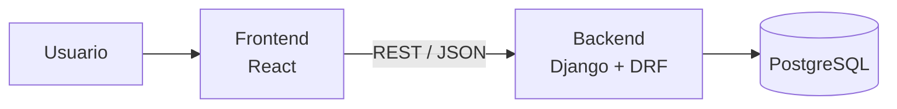

# Analizador de Archivos

Aplicación web que identifica el **tipo real** de un archivo leyendo sus primeros bytes (*magic bytes*), sin confiar en la extensión del nombre. Cada análisis se guarda en una base de datos y se muestran estadísticas de cuántos archivos de cada tipo se han procesado.

Por ejemplo, un archivo llamado `factura.jpg` cuyo contenido empieza con `%PDF` se detecta como **PDF**, no como JPEG.

**Aplicación:** https://frontend-production-e894.up.railway.app
**Documentación de la API (Swagger):** https://backend-production-eb3d.up.railway.app/api/docs/

---

## Arquitectura

Monolito: todo el backend es una sola aplicación Django desplegable. El frontend es una aplicación separada que se comunica con él mediante una **API REST**.



| Capa | Tecnología | Responsabilidad |
|---|---|---|
| Frontend | React (Vite), servido con nginx | Subir archivos y mostrar resultados, tablas y gráficos. El navegador llama directamente a la API |
| Backend | Python, Django, Django REST Framework | Detección del tipo, reglas de negocio y API REST |
| Base de datos | PostgreSQL | Persistencia de los análisis |
| Infraestructura | Docker, Docker Compose | Un contenedor por servicio |
| CI/CD | GitHub Actions, Railway | Tests automáticos y despliegue |

## Cómo funciona la detección

Cada formato de archivo empieza con una secuencia de bytes fija que lo identifica:

| Tipo | Bytes iniciales (hex) | Como texto |
|---|---|---|
| PDF | `25 50 44 46` | `%PDF` |
| PNG | `89 50 4E 47 0D 0A 1A 0A` | `.PNG....` |
| JPEG | `FF D8 FF` | |
| ZIP | `50 4B 03 04` | `PK..` |

El detector (`backend/analizador/detector.py`) compara el contenido con un catálogo de unas 30 firmas y:

1. Si el archivo está vacío, lo informa como **Vacío**.
2. Si coincide una firma, devuelve ese tipo. Algunas firmas revisan más de una posición (WEBP, WAV y AVI comparten el prefijo `RIFF` y se distinguen en el byte 8).
3. Si la firma es ZIP, abre el archivo y revisa sus carpetas internas, porque **DOCX, XLSX y PPTX son archivos ZIP** (`word/`, `xl/`, `ppt/`).
4. Si ninguna firma coincide pero el contenido es UTF-8 válido, lo clasifica como **Texto**.
5. En otro caso, **Desconocido**.

Solo se guarda el resultado del análisis (nombre, extensión, tipo, MIME y tamaño), no el archivo. El tamaño máximo por archivo es de 20 MB.

## API REST

| Método | Ruta | Descripción |
|---|---|---|
| `POST` | `/api/archivos/` | Sube un archivo (`multipart/form-data`, campo `archivo`), lo analiza y guarda el resultado |
| `GET` | `/api/archivos/` | Lista los archivos analizados, del más reciente al más antiguo |
| `GET` | `/api/archivos/{id}/` | Detalle de un análisis |
| `GET` | `/api/archivos/estadisticas/` | Total de archivos, tamaño total y conteo por tipo |

Ejemplo de respuesta de `POST /api/archivos/`:

```json
{
  "id": 1,
  "nombre": "factura.jpg",
  "extension": "jpg",
  "tipo_detectado": "PDF",
  "mime": "application/pdf",
  "tamano": 48213,
  "fecha": "2026-10-03T15:20:00-03:00"
}
```

La documentación interactiva se genera automáticamente con drf-spectacular en `/api/docs/` (Swagger UI) y `/api/redoc/`.

## Ejecutar en local

Requisitos: Docker Desktop. No hace falta instalar Python, Node ni PostgreSQL.

```bash
git clone https://github.com/Johncitoo/Analizador-archivos.git
cd Analizador-archivos
docker compose up --build
```

Las migraciones de la base de datos se aplican automáticamente al arrancar el backend. La configuración tiene valores por defecto para desarrollo; para cambiarlos, copiar `.env.example` a `.env` y editarlo.

| Servicio | URL |
|---|---|
| Frontend | http://localhost:5173 |
| API | http://localhost:8000/api/archivos/ |
| Swagger | http://localhost:8000/api/docs/ |

Para crear un usuario del panel de administración (`/admin/`):

```bash
docker compose exec backend python manage.py createsuperuser
```

## Tests

```bash
docker compose exec backend pytest
```

Los tests cubren el detector (firmas, casos borde, archivos Office, texto UTF-8 y logs) y los endpoints de la API, incluidos validación de extensiones, diagnóstico de desarrollo y CORS. El pipeline exige un **coverage mínimo de 60%** de la aplicación `analizador`; el porcentaje se muestra al ejecutar las pruebas.

Los archivos de pruebas están en:

- `backend/analizador/tests/test_detector.py`: pruebas unitarias de detección y extracción de extensiones.
- `backend/analizador/tests/test_api.py`: pruebas de integración de subidas, validación, persistencia, consultas, estadísticas y documentación.
- `frontend-react/src/components/Analizar.test.jsx`: pruebas de interfaz del límite de 20 MB, selección múltiple y manejo de errores. Las llamadas a la API se simulan.
- `frontend-react/src/api.test.js`: envío multipart, solicitud del diagnóstico y errores de validación.
- `frontend-react/src/diagnostico.test.js`: mensajes de consola, comparación de patrones, ausencia de diagnóstico y nombres tratados como texto.

Para ejecutar las pruebas de la interfaz:

```bash
docker compose exec frontend npm test
```

Las pruebas de React utilizan Vitest, Testing Library y jsdom. También se pueden ejecutar desde `frontend-react` con `npm ci` y `npm test`; `npm run build` comprueba la compilación. La interfaz admite varios archivos y comprueba el tamaño de cada uno antes de enviarlo. Acepta exactamente 20 MiB y rechaza tamaños mayores sin llamar a la API. El backend mantiene su propia validación y rechaza extensiones de más de 20 caracteres con HTTP 400 antes de guardar.

Los archivos de la carpeta `frontend/` corresponden a la interfaz anterior en Streamlit. Docker Compose y el pipeline principal utilizan React en `frontend-react/`; las pruebas de Streamlit no validan esta interfaz.

Para probar el corte de la muestra UTF-8 y un byte inválido, usar los archivos e instrucciones de `ejemplos/`. La detección de texto revisa una muestra de 8192 bytes y completa el carácter cortado si hace falta; no valida todo el contenido de un archivo grande.

## Logs de detección

Los logs salen por la consola del backend. En desarrollo (`DJANGO_DEBUG=1`) se muestra el detalle; en producción el nivel predeterminado es `INFO`. Se puede elegir explícitamente con `DJANGO_LOG_LEVEL=DEBUG` o `DJANGO_LOG_LEVEL=INFO` en el entorno y reiniciando el backend.

Con nivel `DEBUG`, cada detección muestra:

- Tamaño del archivo y una muestra de hasta 16 bytes iniciales en hexadecimal y bits (8 bits por byte).
- Para cada patrón de una firma coincidente, su tipo, posición desde cero, longitud y bytes esperados/encontrados en hexadecimal y bits. Las firmas con varias posiciones, como WAV, muestran cada patrón por separado.
- Resultado final. Para Office se distingue la firma ZIP del tipo DOCX/XLSX/PPTX obtenido de las entradas internas. Para Texto y Desconocido se indica que no hubo coincidencia de firma.

Ejemplo de coincidencia PDF:

```text
Firma coincidente: tipo=PDF offset=0 longitud=4 esperado_hex=[25 50 44 46] encontrado_hex=[25 50 44 46] esperado_bits=[00100101 01010000 01000100 01000110] encontrado_bits=[00100101 01010000 01000100 01000110]
Resultado de deteccion: tipo=PDF mime=application/pdf
```

No se vuelca el archivo completo ni se registra su nombre. La muestra puede contener parte del contenido, por lo que para el uso habitual en producción se recomienda `INFO`, que no muestra bytes.

El cliente React solicita un diagnóstico mediante `POST /api/archivos/?diagnostico=1`. Solo en desarrollo (`DJANGO_DEBUG=1`), el backend añade a esa respuesta la muestra y los patrones coincidentes; no los guarda en la base de datos ni los incluye en el historial o detalle. React los imprime directamente en la consola del navegador (F12 → Consola) al pulsar Analizar, agrupados por nombre de archivo. La tabla compara posición, longitud, hexadecimal y bits esperados/encontrados. Si no coincide una firma, lo indica sin inventar patrones. Los nombres se pasan como valores de texto, sin generar HTML.

En producción (`DJANGO_DEBUG=0`) no se envía este diagnóstico, aunque se solicite. Estos mensajes del navegador son independientes de `DJANGO_LOG_LEVEL`, que controla la consola del backend. Para comprobarlos, abrir http://localhost:5173, habilitar el nivel Información en la consola y analizar un archivo.

Con Docker, consultar los logs mediante:

```bash
docker compose logs -f backend
```

## CI/CD

- **Integración continua:** en cada push a `main` y en las pull requests, GitHub Actions (`.github/workflows/ci.yml`) levanta un PostgreSQL temporal, verifica la configuración y las migraciones, corre los tests del backend con coverage y las pruebas de React, compila el frontend y construye las imágenes Docker del backend y del frontend. Los pushes a otras ramas sin pull request no disparan este workflow.
- **Despliegue continuo:** la conexión del repositorio a Railway y la condición de esperar el éxito de CI se configuran en la plataforma; deben verificarse allí. El backend aplica migraciones al arrancar. La imagen de producción de React necesita `VITE_API_URL` como argumento de construcción para apuntar a la API desplegada.

## Estructura del proyecto

```
.
├── backend/
│   ├── config/              Configuración de Django (settings, urls)
│   ├── analizador/          Aplicación principal
│   │   ├── detector.py      Detección por magic bytes
│   │   ├── models.py        Modelo ArchivoAnalizado
│   │   ├── serializers.py   Validación y conversión a JSON
│   │   ├── views.py         Endpoints de la API
│   │   ├── urls.py          Rutas de la API
│   │   ├── migrations/      Migraciones de la base de datos
│   │   └── tests/           Tests del detector y de la API
│   ├── Dockerfile
│   └── requirements.txt
├── frontend-react/
│   ├── src/
│   │   ├── App.jsx          Pestañas (Analizar, Estadísticas, Historial)
│   │   ├── api.js           Cliente HTTP de la API (fetch)
│   │   ├── diagnostico.js   Logs de firmas en la consola del navegador
│   │   ├── *.test.js        Pruebas del cliente y diagnóstico
│   │   └── components/      Pantallas y tabla de archivos
│   ├── Dockerfile           Desarrollo (Vite) y producción (nginx)
│   └── package.json
├── .github/workflows/ci.yml Pipeline de GitHub Actions
└── docker-compose.yml       Entorno local: db, backend y frontend
```
