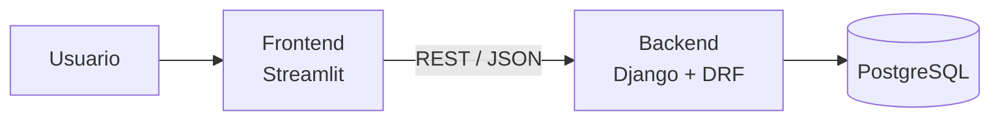

# Analizador de Archivos

Aplicación web que identifica el **tipo real** de un archivo leyendo sus primeros bytes (*magic bytes*), sin confiar en la extensión del nombre. Cada análisis se guarda en una base de datos y se muestran estadísticas de cuántos archivos de cada tipo se han procesado.

Por ejemplo, un archivo llamado `factura.jpg` cuyo contenido empieza con `%PDF` se detecta como **PDF**, no como JPEG.

**Aplicación:** https://frontend-production-e894.up.railway.app
**Documentación de la API (Swagger):** https://backend-production-eb3d.up.railway.app/api/docs/

---

## Arquitectura

Monolito: todo el backend es una sola aplicación Django desplegable. El frontend es una aplicación separada que se comunica con él mediante una **API REST**.



| Capa | Tecnología | Responsabilidad |
|---|---|---|
| Frontend | Python, Streamlit | Subir archivos y mostrar resultados, tablas y gráficos |
| Backend | Python, Django, Django REST Framework | Detección del tipo, reglas de negocio y API REST |
| Base de datos | PostgreSQL | Persistencia de los análisis |
| Infraestructura | Docker, Docker Compose | Un contenedor por servicio |
| CI/CD | GitHub Actions, Railway | Tests automáticos y despliegue |

## Cómo funciona la detección

Cada formato de archivo empieza con una secuencia de bytes fija que lo identifica:

| Tipo | Bytes iniciales (hex) | Como texto |
|---|---|---|
| PDF | `25 50 44 46` | `%PDF` |
| PNG | `89 50 4E 47 0D 0A 1A 0A` | `.PNG....` |
| JPEG | `FF D8 FF` | |
| ZIP | `50 4B 03 04` | `PK..` |

El detector (`backend/analizador/detector.py`) compara el contenido con un catálogo de unas 30 firmas y:

1. Si el archivo está vacío, lo informa como **Vacío**.
2. Si coincide una firma, devuelve ese tipo. Algunas firmas revisan más de una posición (WEBP, WAV y AVI comparten el prefijo `RIFF` y se distinguen en el byte 8).
3. Si la firma es ZIP, abre el archivo y revisa sus carpetas internas, porque **DOCX, XLSX y PPTX son archivos ZIP** (`word/`, `xl/`, `ppt/`).
4. Si ninguna firma coincide pero el contenido es UTF-8 válido, lo clasifica como **Texto**.
5. En otro caso, **Desconocido**.

Solo se guarda el resultado del análisis (nombre, extensión, tipo, MIME y tamaño), no el archivo. El tamaño máximo por archivo es de 20 MB.

## API REST

| Método | Ruta | Descripción |
|---|---|---|
| `POST` | `/api/archivos/` | Sube un archivo (`multipart/form-data`, campo `archivo`), lo analiza y guarda el resultado |
| `GET` | `/api/archivos/` | Lista los archivos analizados, del más reciente al más antiguo |
| `GET` | `/api/archivos/{id}/` | Detalle de un análisis |
| `GET` | `/api/archivos/estadisticas/` | Total de archivos, tamaño total y conteo por tipo |

Ejemplo de respuesta de `POST /api/archivos/`:

```json
{
  "id": 1,
  "nombre": "factura.jpg",
  "extension": "jpg",
  "tipo_detectado": "PDF",
  "mime": "application/pdf",
  "tamano": 48213,
  "fecha": "2026-10-03T15:20:00-03:00"
}
```

La documentación interactiva se genera automáticamente con drf-spectacular en `/api/docs/` (Swagger UI) y `/api/redoc/`.

## Ejecutar en local

Requisitos: Docker Desktop.

```bash
cp .env.example .env
docker compose up -d --build
docker compose exec backend python manage.py migrate
```

| Servicio | URL |
|---|---|
| Frontend | http://localhost:8501 |
| API | http://localhost:8000/api/archivos/ |
| Swagger | http://localhost:8000/api/docs/ |

Para crear un usuario del panel de administración (`/admin/`):

```bash
docker compose exec backend python manage.py createsuperuser
```

## Tests

```bash
docker compose exec backend pytest
```

Los tests cubren el detector (firmas, casos borde, archivos Office, texto) y todos los endpoints de la API, incluidos los casos de error. El pipeline exige un **coverage mínimo de 60%**; el actual es 100%.

## CI/CD

- **Integración continua:** en cada push a `main`, GitHub Actions (`.github/workflows/ci.yml`) levanta un PostgreSQL temporal, verifica la configuración y las migraciones, corre los tests con coverage y construye las imágenes Docker del backend y del frontend.
- **Despliegue continuo:** Railway está conectado al repositorio y despliega automáticamente cada cambio en `main` solo si el pipeline de GitHub Actions termina con éxito. Al arrancar, el backend aplica las migraciones pendientes.

## Estructura del proyecto

```
.
├── backend/
│   ├── config/              Configuración de Django (settings, urls)
│   ├── analizador/          Aplicación principal
│   │   ├── detector.py      Detección por magic bytes
│   │   ├── models.py        Modelo ArchivoAnalizado
│   │   ├── serializers.py   Validación y conversión a JSON
│   │   ├── views.py         Endpoints de la API
│   │   ├── urls.py          Rutas de la API
│   │   ├── migrations/      Migraciones de la base de datos
│   │   └── tests/           Tests del detector y de la API
│   ├── Dockerfile
│   └── requirements.txt
├── frontend/
│   ├── app.py               Pantallas (Analizar, Estadísticas, Historial)
│   ├── api.py               Cliente HTTP de la API
│   ├── Dockerfile
│   └── requirements.txt
├── .github/workflows/ci.yml Pipeline de GitHub Actions
└── docker-compose.yml       Entorno local: db, backend y frontend
```
